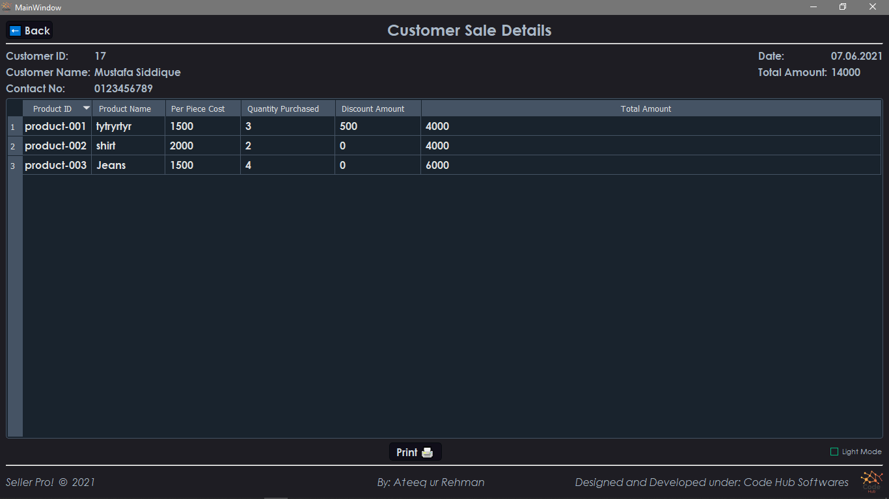

# **_Seller Pro_ - Smart Sales and Inventory Management System**

Everything is getting digitalized, your business needs it too. Instead of maintaining your business "khata" using a pen and register by yourself, this software will do it for you!
From noting the purchasing record of your business, calculation of daily expenditures to keeping the track of your sales records, this software has got your back ♥

Moreover, from automating all the boring stuff, it will also give you one-touch daily sales to match the money in your drawer, making your business 100% corruption proof :D (Incase someone else operates your business)

♦ No Maintainance charges at all.

♦ Free Customer Support for the first 3 months.

♦ Fully Customizable upon your request.

♦ Dark and Light Mode Support: to relieve your eyes.

Feel free to Contact:

Name: Ateeq ur Rehman

Email: ateeqmughal272@gmail.com

Cell: +92 345 2523678

Location: Karachi, Pakistan.

--------------------------------------------------------------------------

### Purchase Panel - Entry of your inventory (the articles you buy to sell).

### Sales Panel - Where you sell to the customers.

### Stock Panel - Where you see all your business records, Profits, etc.

### Expense Panel - To record your daily expenditures in a smart manner.

### Purchase Record - Where you can see all your purchase history efficiently.

### Sales Record - Where you can see all your selling history efficiently.

### Total Sale - Total Sale by date ensures your cash amount matches with daily sales.

### Customer Sales Details - Where you can see individual customer sales invoice.

### Printed Invoice - This Will be customized according to your business name and logo.

